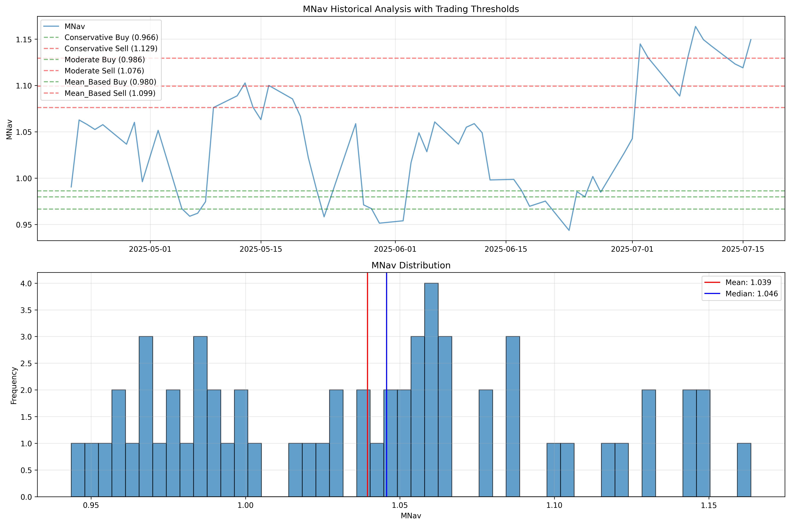

# MARA BTC Tracking & MNav Backtesting

[](LICENSE)
[](https://www.python.org/downloads/)
[](https://github.com/PeachyBuffalo/MARABTCTracking/actions/workflows/python-app.yml)

## Overview
This project provides a robust system for:
- **Monitoring and alerting** on MARA's MNav (Market NAV) changes
- **Backtesting** MNav-based trading strategies across multiple timeframes
- **Analyzing historical relationships** between MARA and BTC

## Features
- Fetches historical MARA prices (yfinance) and BTC prices (CoinGecko, with fallbacks)
- Multi-period backtesting: 1 day, 1 week, 1 month, 3 months, 6 months, 1 year
- Buy/sell threshold suggestions based on MNav distribution
- Caching system for fast, rate-limit-free repeated runs
- Fallback to multiple BTC APIs if CoinGecko is rate-limited
- Easy-to-use alert script for live monitoring

## Screenshots

### Backtest Results

*MNav historical analysis showing trading thresholds and distribution over time*

### Alert System

*Sample email alert when MNav changes exceed threshold*

## Setup
1. **Clone the repository**
2. **Install dependencies**:
   ```bash
   pip install -r requirements.txt
   ```
3. **Set up your secrets**:
   - Copy `.env.example` to `.env` and fill in your email and (optionally) API key:
     ```bash
     cp .env.example .env
     # Edit .env with your credentials
     ```
   - **Never commit your `.env` file!**
4. *(Optional but recommended)*: Use a Python virtual environment

## Usage
### Backtesting
Run the backtest for all periods (uses cache if available):
```bash
python mnav_backtest.py
```

**Force refresh all data (clear cache):**
```bash
python mnav_backtest.py --clear-cache
```

- Results and suggested thresholds will be printed for each period.
- Cached data is stored in the `cache/` directory for 24 hours by default.

### Live MNav Alert
Set your email credentials in `.env`, then run:
```bash
python mnav_alert.py
```
- The script will check MNav every hour and send an email if a drastic change is detected.

## Configuration
- **Cache duration**: Change `CACHE_DURATION_HOURS` in `mnav_backtest.py` to adjust cache expiry.
- **BTC price APIs**: The script will automatically try CoinGecko, Binance, and CoinDesk for BTC prices.
- **Email alerts**: Edit your `.env` file for `EMAIL_TO`, `EMAIL_FROM`, and `EMAIL_PASS`.

## Notes
- **API Rate Limits**: CoinGecko has a free tier rate limit. The script will use cached data or fallback APIs if needed.
- **Data Freshness**: Cached data is valid for 24 hours. Use `--clear-cache` to force a refresh.
- **No SEC/EDGAR integration**: The current version does not fetch SEC filings.
- **.env file**: Never commit your `.env` file. Use `.env.example` as a template for sharing.

## Requirements
- Python 3.8+
- See `requirements.txt` for dependencies

## License
MIT License